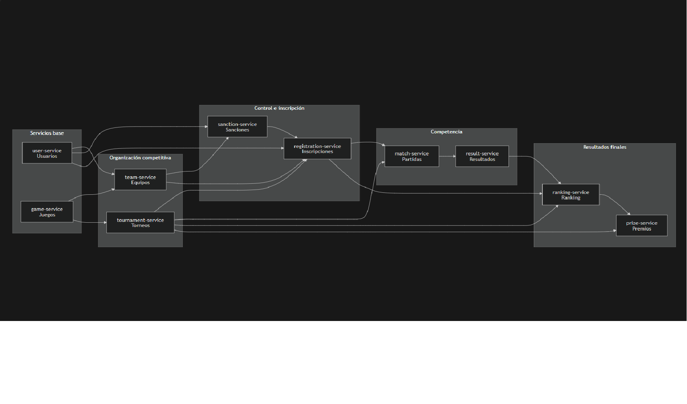
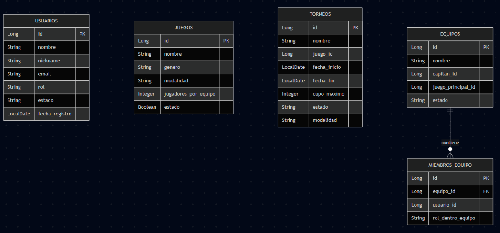
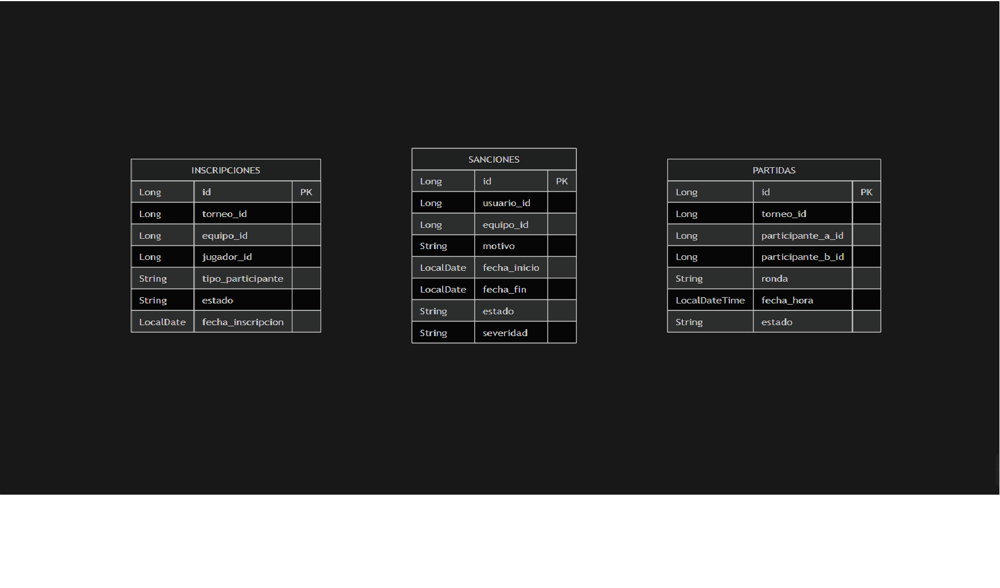
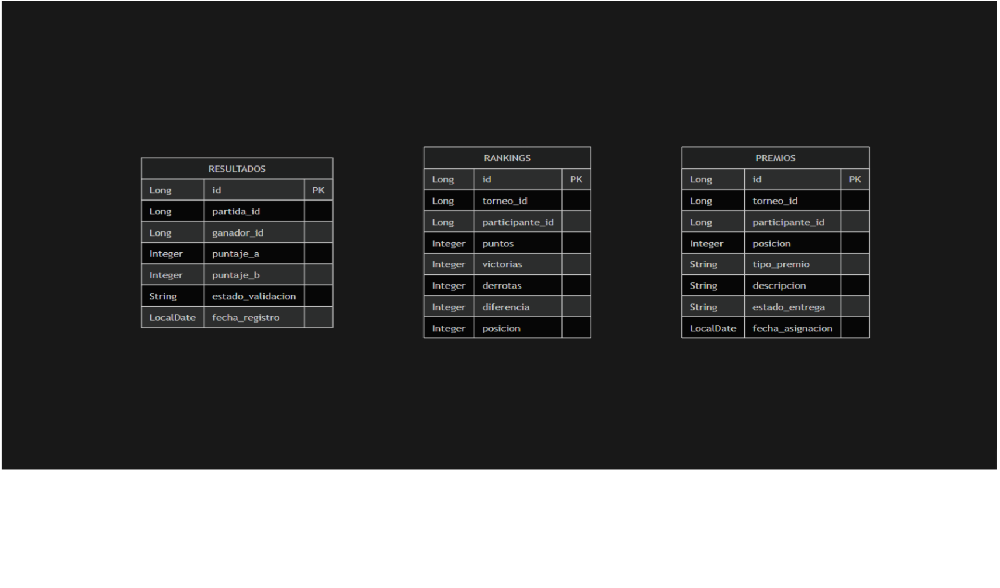
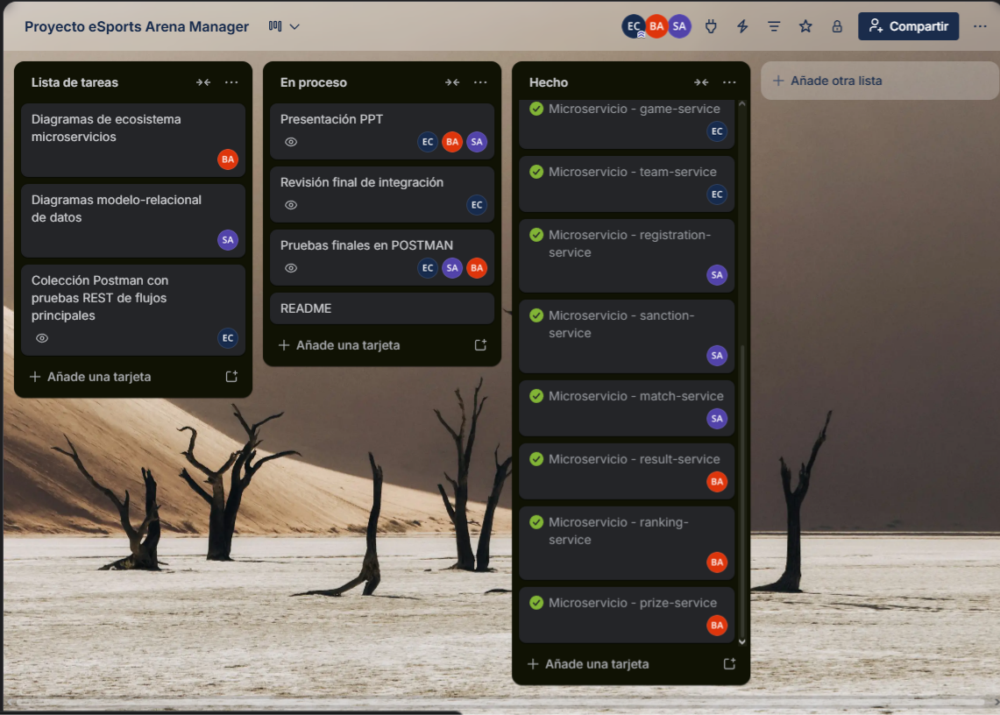

# Proyecto eSports Arena Manager

Proyecto desarrollado para la asignatura **FullStack 1**, basado en una arquitectura de microservicios con Spring Boot.

El sistema permite administrar una plataforma de torneos eSports, considerando la gestión de usuarios, juegos, equipos, torneos, inscripciones, sanciones, partidas, resultados, ranking y premios.

---

## Informe del proyecto

El informe técnico del proyecto se encuentra disponible en el siguiente archivo:

[Descargar informe PDF](Informe_eSports_Arena_Manager.pdf)

---

## Integrantes

- Emanuel Serey
- Sebastián Ahumada
- Benjamín Gutiérrez

---

## Tecnologías utilizadas

- Java 25
- Spring Boot
- Spring Web
- Spring Data JPA
- Spring Cloud OpenFeign
- Spring Cloud Eureka
- Spring Cloud Gateway
- H2 Database
- Maven
- Lombok
- Swagger / OpenAPI
- HATEOAS
- JUnit 5
- Mockito
- IntelliJ IDEA
- Postman
- Git / GitHub

---

## Microservicios implementados

| Microservicio | Puerto | Responsabilidad |
|---|---:|---|
| user-service | 8087 | Gestiona usuarios del sistema |
| game-service | 8083 | Gestiona juegos disponibles |
| tournament-service | 8084 | Gestiona torneos |
| team-service | 8085 | Gestiona equipos y miembros |
| registration-service | 8086 | Gestiona inscripciones a torneos |
| sanction-service | 8088 | Gestiona sanciones de usuarios y equipos |
| match-service | 8089 | Gestiona partidas del torneo |
| result-service | 8090 | Gestiona resultados de partidas |
| ranking-service | 8091 | Gestiona ranking y posiciones |
| prize-service | 8092 | Gestiona premios del torneo |

### Servicios de infraestructura

| Servicio | Puerto | Responsabilidad |
|---|---:|---|
| eureka-service | 8761 | Servidor de descubrimiento de microservicios |
| api-gateway-service | 8080 | Punto único de entrada hacia los microservicios |

---

## Estructura del proyecto

```text
proyecto-esports-arena-manager/
├── api-gateway-service/
├── eureka-service/
├── user-service/
├── game-service/
├── tournament-service/
├── team-service/
├── registration-service/
├── sanction-service/
├── match-service/
├── result-service/
├── ranking-service/
├── prize-service/
├── docs/
├── README.md
└── .gitignore
```

Cada microservicio posee su propia estructura Spring Boot:

```text
microservicio/
├── src/
│   ├── main/
│   │   ├── java/
│   │   └── resources/
│   └── test/
│       └── java/
├── pom.xml
├── mvnw
└── mvnw.cmd
```

---

## Arquitectura general

El sistema se organiza bajo una arquitectura de microservicios. Cada servicio tiene una responsabilidad específica y se comunica con otros servicios mediante clientes Feign.

Cada microservicio cuenta con su propia base de datos H2, evitando una base de datos única centralizada. Las relaciones entre microservicios se manejan mediante identificadores lógicos y validaciones por API REST.

Además, se incorporó **Eureka Server** para el registro y descubrimiento de servicios, junto con un **API Gateway** que centraliza las rutas de acceso hacia los microservicios. De esta forma, el cliente puede consumir los servicios desde un único punto de entrada en el puerto `8080`, sin conocer directamente los puertos internos de cada microservicio.

---

## Diagrama del ecosistema de microservicios

Las flechas indican que el microservicio de origen consulta o consume al microservicio de destino mediante OpenFeign.



---

## Modelo relacional de bases de datos principales

Cada microservicio posee su propia base de datos H2. Por este motivo, las relaciones entre servicios no se implementan como claves foráneas físicas entre bases de datos distintas, sino mediante IDs lógicos y validaciones realizadas entre microservicios.

### Modelo relacional: user-service, game-service, tournament-service y team-service



### Modelo relacional: registration-service, sanction-service y match-service



### Modelo relacional: result-service, ranking-service y prize-service



---

## Comunicación entre microservicios

El proyecto utiliza **Spring Cloud OpenFeign** para permitir el consumo de endpoints entre microservicios. Esto permite validar datos externos antes de ejecutar reglas de negocio propias de cada servicio.

| Microservicio | Consume |
|---|---|
| tournament-service | game-service |
| team-service | user-service, game-service |
| sanction-service | user-service, team-service |
| registration-service | tournament-service, team-service, user-service, sanction-service |
| match-service | tournament-service, registration-service |
| result-service | match-service |
| ranking-service | tournament-service, registration-service, result-service |
| prize-service | tournament-service, ranking-service |

Las respuestas remotas son validadas en la capa de servicio. En caso de errores, se manejan excepciones diferenciadas para evitar respuestas genéricas y entregar códigos HTTP adecuados.

---

## Eureka Server

Se implementó `eureka-service` como servidor de descubrimiento de servicios.

Eureka permite que los microservicios se registren automáticamente mediante su nombre lógico, facilitando que el API Gateway pueda localizarlos sin depender directamente de puertos fijos.

URL de Eureka:

```text
http://localhost:8761
```

Desde esta interfaz se puede verificar que todos los servicios estén registrados y en estado `UP`.

Servicios registrados en Eureka:

```text
API-GATEWAY-SERVICE
GAME-SERVICE
MATCH-SERVICE
PRIZE-SERVICE
RANKING-SERVICE
REGISTRATION-SERVICE
RESULT-SERVICE
SANCTION-SERVICE
TEAM-SERVICE
TOURNAMENT-SERVICE
USER-SERVICE
```

---

## API Gateway

Se implementó `api-gateway-service` como punto único de entrada hacia los microservicios.

El Gateway se ejecuta en:

```text
http://localhost:8080
```

Su función es centralizar las solicitudes y enrutar cada petición hacia el microservicio correspondiente usando los nombres lógicos registrados en Eureka.

### Rutas principales del Gateway

| Microservicio | Ruta Gateway |
|---|---|
| user-service | `/api/usuarios/**` y `/api/v2/usuarios/**` |
| game-service | `/api/juegos/**` y `/api/v2/juegos/**` |
| tournament-service | `/api/torneos/**` y `/api/v2/torneos/**` |
| team-service | `/api/equipos/**` y `/api/v2/equipos/**` |
| registration-service | `/api/inscripciones/**` y `/api/v2/inscripciones/**` |
| sanction-service | `/api/sanciones/**` y `/api/v2/sanciones/**` |
| match-service | `/api/partidas/**` y `/api/v2/partidas/**` |
| result-service | `/api/resultados/**` y `/api/v2/resultados/**` |
| ranking-service | `/api/rankings/**` y `/api/v2/rankings/**` |
| prize-service | `/api/premios/**` y `/api/v2/premios/**` |

### Ejemplos de consumo mediante Gateway

```text
GET http://localhost:8080/api/v2/usuarios/1
GET http://localhost:8080/api/v2/juegos/1
GET http://localhost:8080/api/v2/torneos/1
GET http://localhost:8080/api/v2/equipos/1
GET http://localhost:8080/api/v2/inscripciones/1
GET http://localhost:8080/api/v2/sanciones/1
GET http://localhost:8080/api/v2/partidas/1
GET http://localhost:8080/api/v2/resultados/1
GET http://localhost:8080/api/v2/rankings/1
GET http://localhost:8080/api/v2/premios/1
```

---

## Configuración con archivos YAML y properties

El proyecto utiliza archivos de configuración para definir propiedades de entorno, puertos, rutas del Gateway y conexión con Eureka.

El `api-gateway-service` utiliza `application.yml` para definir sus rutas:

```yaml
server:
  port: 8080

spring:
  application:
    name: api-gateway-service

  cloud:
    gateway:
      server:
        webmvc:
          routes:
            - id: user-service
              uri: lb://user-service
              predicates:
                - Path=/api/usuarios/**,/api/v2/usuarios/**
```

Los microservicios de negocio utilizan archivos `application.properties` para definir:

- Nombre lógico del servicio.
- Puerto de ejecución.
- Conexión con Eureka.
- Configuración de base de datos H2.
- Configuración de JPA.
- Consola H2.
- Swagger/OpenAPI.

Ejemplo de configuración de cliente Eureka en un microservicio:

```properties
spring.application.name=user-service
server.port=8087

eureka.client.service-url.defaultZone=http://localhost:8761/eureka/
eureka.instance.prefer-ip-address=true
eureka.instance.hostname=localhost
eureka.instance.instance-id=${spring.application.name}:${server.port}
```

En un ambiente productivo, las configuraciones sensibles o dependientes del entorno, como credenciales, URLs externas o claves secretas, deben gestionarse mediante variables de entorno o perfiles separados, por ejemplo `dev` y `prod`.

---

## Documentación Swagger / OpenAPI

Cada microservicio cuenta con documentación Swagger/OpenAPI de forma individual.

| Microservicio | Swagger local |
|---|---|
| user-service | http://localhost:8087/swagger-ui/index.html |
| game-service | http://localhost:8083/swagger-ui/index.html |
| tournament-service | http://localhost:8084/swagger-ui/index.html |
| team-service | http://localhost:8085/swagger-ui/index.html |
| registration-service | http://localhost:8086/swagger-ui/index.html |
| sanction-service | http://localhost:8088/swagger-ui/index.html |
| match-service | http://localhost:8089/swagger-ui/index.html |
| result-service | http://localhost:8090/swagger-ui/index.html |
| ranking-service | http://localhost:8091/swagger-ui/index.html |
| prize-service | http://localhost:8092/swagger-ui/index.html |

Swagger se mantiene en cada microservicio para documentar sus endpoints de forma individual, mientras que el API Gateway centraliza el consumo de las rutas desde el puerto `8080`.

---

## HATEOAS

Se implementaron controladores versión 2 en los microservicios, incorporando enlaces HATEOAS mediante el objeto `_links`.

Ejemplo de endpoint HATEOAS consumido desde Gateway:

```text
GET http://localhost:8080/api/v2/usuarios/1
```

Ejemplo de respuesta esperada:

```json
{
  "_links": {
    "self": {
      "href": "http://localhost:8087/api/v2/usuarios/1"
    },
    "usuarios": {
      "href": "http://localhost:8087/api/v2/usuarios"
    }
  },
  "id": 1,
  "nombre": "Cristiano Ronaldo",
  "nickname": "CR7",
  "rol": "JUGADOR",
  "estado": "ACTIVO"
}
```

Los enlaces HATEOAS permiten entregar respuestas más navegables, incluyendo referencias a recursos relacionados, como listado general, búsqueda por estado, búsqueda por rol o acciones específicas según el microservicio.

---

## Manejo de errores y códigos HTTP

El proyecto implementa manejo centralizado de excepciones mediante `ControllerAdvice`, permitiendo entregar respuestas estructuradas ante errores.

Se utilizan códigos HTTP diferenciados según el caso:

| Código | Uso |
|---:|---|
| 400 Bad Request | Solicitud inválida |
| 404 Not Found | Recurso no encontrado |
| 409 Conflict | Conflicto con reglas de negocio |
| 422 Unprocessable Content | Validación de datos |
| 500 Internal Server Error | Error interno del servidor |
| 503 Service Unavailable | Error en comunicación con servicios externos |

Ejemplo de estructura de error:

```json
{
  "timestamp": "2026-05-25T20:30:00",
  "status": 404,
  "error": "NOT_FOUND",
  "message": "Usuario no encontrado",
  "path": "/api/usuarios/99"
}
```

---

## Base de datos H2

Cada microservicio utiliza H2 en modo archivo.

Ejemplo de configuración:

```properties
spring.datasource.url=jdbc:h2:file:./data/userdb
spring.datasource.driver-class-name=org.h2.Driver
spring.datasource.username=sa
spring.datasource.password=
spring.jpa.hibernate.ddl-auto=update
spring.h2.console.enabled=true
spring.h2.console.path=/h2-console
```

Consola H2 por microservicio:

| Microservicio | URL H2 |
|---|---|
| user-service | http://localhost:8087/h2-console |
| game-service | http://localhost:8083/h2-console |
| tournament-service | http://localhost:8084/h2-console |
| team-service | http://localhost:8085/h2-console |
| registration-service | http://localhost:8086/h2-console |
| sanction-service | http://localhost:8088/h2-console |
| match-service | http://localhost:8089/h2-console |
| result-service | http://localhost:8090/h2-console |
| ranking-service | http://localhost:8091/h2-console |
| prize-service | http://localhost:8092/h2-console |

---

## Endpoints principales

Los endpoints se encuentran disponibles tanto de forma directa en cada microservicio como mediante el API Gateway.

Ejemplo directo:

```text
http://localhost:8087/api/usuarios
```

Ejemplo mediante Gateway:

```text
http://localhost:8080/api/usuarios
```

### user-service

| Método | Endpoint | Descripción |
|---|---|---|
| POST | `/api/usuarios` | Crear usuario |
| GET | `/api/usuarios` | Listar usuarios |
| GET | `/api/usuarios/{id}` | Buscar usuario por ID |
| PUT | `/api/usuarios/{id}` | Actualizar usuario |
| DELETE | `/api/usuarios/{id}` | Desactivar usuario |
| GET | `/api/usuarios/rol/{rol}` | Listar por rol |
| GET | `/api/usuarios/estado/{estado}` | Listar por estado |
| GET | `/api/usuarios/nickname/{nickname}` | Buscar por nickname |

### game-service

| Método | Endpoint | Descripción |
|---|---|---|
| POST | `/api/juegos` | Crear juego |
| GET | `/api/juegos` | Listar juegos |
| GET | `/api/juegos/{id}` | Buscar juego por ID |
| GET | `/api/juegos/activos` | Listar juegos activos |
| PUT | `/api/juegos/{id}` | Actualizar juego |
| DELETE | `/api/juegos/{id}` | Desactivar juego |

### tournament-service

| Método | Endpoint | Descripción |
|---|---|---|
| POST | `/api/torneos` | Crear torneo |
| GET | `/api/torneos` | Listar torneos |
| GET | `/api/torneos/{id}` | Buscar torneo por ID |
| PUT | `/api/torneos/{id}` | Actualizar torneo |
| PUT | `/api/torneos/{id}/cancelar` | Cancelar torneo |
| PUT | `/api/torneos/{id}/cerrar` | Cerrar torneo |
| GET | `/api/torneos/juego/{juegoId}` | Listar por juego |
| GET | `/api/torneos/estado/{estado}` | Listar por estado |

### team-service

| Método | Endpoint | Descripción |
|---|---|---|
| POST | `/api/equipos` | Crear equipo |
| GET | `/api/equipos` | Listar equipos |
| GET | `/api/equipos/{id}` | Buscar equipo por ID |
| PUT | `/api/equipos/{id}` | Actualizar equipo |
| DELETE | `/api/equipos/{id}` | Desactivar equipo |
| POST | `/api/equipos/{equipoId}/miembros` | Agregar miembro |
| GET | `/api/equipos/{equipoId}/miembros` | Listar miembros |
| DELETE | `/api/equipos/{equipoId}/miembros/{miembroId}` | Eliminar miembro |

### registration-service

| Método | Endpoint | Descripción |
|---|---|---|
| POST | `/api/inscripciones` | Crear inscripción |
| GET | `/api/inscripciones` | Listar inscripciones |
| GET | `/api/inscripciones/{id}` | Buscar inscripción por ID |
| PUT | `/api/inscripciones/{id}/estado/{estado}` | Actualizar estado |
| PUT | `/api/inscripciones/{id}/cancelar` | Cancelar inscripción |
| GET | `/api/inscripciones/torneo/{torneoId}` | Listar por torneo |
| GET | `/api/inscripciones/equipo/{equipoId}` | Listar por equipo |
| GET | `/api/inscripciones/jugador/{jugadorId}` | Listar por jugador |

### sanction-service

| Método | Endpoint | Descripción |
|---|---|---|
| POST | `/api/sanciones` | Crear sanción |
| GET | `/api/sanciones` | Listar sanciones |
| GET | `/api/sanciones/{id}` | Buscar sanción por ID |
| PUT | `/api/sanciones/{id}` | Actualizar sanción |
| PUT | `/api/sanciones/{id}/cerrar` | Cerrar sanción |
| GET | `/api/sanciones/usuario/{usuarioId}` | Listar por usuario |
| GET | `/api/sanciones/equipo/{equipoId}` | Listar por equipo |
| GET | `/api/sanciones/usuario/{usuarioId}/activa` | Validar sanción activa de usuario |
| GET | `/api/sanciones/equipo/{equipoId}/activa` | Validar sanción activa de equipo |

### match-service

| Método | Endpoint | Descripción |
|---|---|---|
| POST | `/api/partidas` | Crear partida |
| GET | `/api/partidas` | Listar partidas |
| GET | `/api/partidas/{id}` | Buscar partida por ID |
| PUT | `/api/partidas/{id}` | Actualizar partida |
| PUT | `/api/partidas/{id}/estado/{estado}` | Actualizar estado |
| PUT | `/api/partidas/{id}/cancelar` | Cancelar partida |
| GET | `/api/partidas/torneo/{torneoId}` | Listar por torneo |

### result-service

| Método | Endpoint | Descripción |
|---|---|---|
| POST | `/api/resultados` | Crear resultado |
| GET | `/api/resultados` | Listar resultados |
| GET | `/api/resultados/{id}` | Buscar resultado por ID |
| PUT | `/api/resultados/{id}` | Actualizar resultado |
| PUT | `/api/resultados/{id}/validar` | Validar resultado |
| PUT | `/api/resultados/{id}/anular` | Anular resultado |
| GET | `/api/resultados/partida/{partidaId}` | Buscar por partida |

### ranking-service

| Método | Endpoint | Descripción |
|---|---|---|
| POST | `/api/rankings` | Crear ranking |
| GET | `/api/rankings` | Listar rankings |
| GET | `/api/rankings/{id}` | Buscar ranking por ID |
| GET | `/api/rankings/torneo/{torneoId}` | Listar ranking por torneo |
| GET | `/api/rankings/torneo/{torneoId}/participante/{participanteId}` | Buscar posición de participante |
| PUT | `/api/rankings/{id}` | Actualizar ranking |
| DELETE | `/api/rankings/torneo/{torneoId}/reiniciar` | Reiniciar ranking |
| PUT | `/api/rankings/resultado/{resultadoId}` | Actualizar ranking por resultado |

### prize-service

| Método | Endpoint | Descripción |
|---|---|---|
| POST | `/api/premios` | Asignar premio |
| GET | `/api/premios` | Listar premios |
| GET | `/api/premios/{id}` | Buscar premio por ID |
| GET | `/api/premios/torneo/{torneoId}` | Listar premios por torneo |
| GET | `/api/premios/participante/{participanteId}` | Listar premios por participante |
| PUT | `/api/premios/{id}/entregar` | Entregar premio |
| PUT | `/api/premios/{id}/anular` | Anular premio |

---

## Pruebas unitarias

Se implementaron pruebas unitarias con **JUnit 5** y **Mockito** sobre la capa de servicios de los microservicios.

Las pruebas consideran:

- Casos exitosos.
- Validaciones de reglas de negocio.
- Manejo de excepciones.
- Interacción con repositorios simulados mediante Mockito.
- Validación de respuestas esperadas.

Resumen de pruebas ejecutadas:

| Microservicio        | Clase de prueba             | Pruebas ejecutadas | Métodos o funcionalidades evaluadas                                                                                              |
| -------------------- | --------------------------- | -----------------: | -------------------------------------------------------------------------------------------------------------------------------- |
| user-service         | UserServiceImplTest         |                 13 | Crear usuario, listar usuarios, buscar por ID, actualizar, desactivar, validar nickname y email duplicado                        |
| game-service         | GameServiceImplTest         |                  8 | Crear juego, listar juegos, buscar por ID, actualizar y desactivar juego                                                         |
| tournament-service   | TournamentServiceImplTest   |                 14 | Crear torneo, validar juego, listar torneos, buscar por ID, actualizar, cancelar y cerrar torneo                                 |
| team-service         | TeamServiceImplTest         |                 20 | Crear equipo, validar usuario, validar juego, agregar miembro, listar miembros y eliminar miembro                                |
| registration-service | RegistrationServiceImplTest |                 24 | Crear inscripción, validar torneo, validar equipo, validar usuario, validar sanciones, cancelar inscripción y listar por filtros |
| sanction-service     | SanctionServiceImplTest     |                 20 | Crear sanción, buscar por ID, listar sanciones, cerrar sanción y validar sanciones activas                                       |
| match-service        | MatchServiceImplTest        |                 20 | Crear partida, validar torneo, validar participantes, actualizar estado, cancelar partida y listar por torneo                    |
| result-service       | ResultServiceImplTest       |                 16 | Crear resultado, buscar por ID, validar resultado, anular resultado y buscar por partida                                         |
| ranking-service      | RankingServiceImplTest      |                 17 | Crear ranking, buscar por torneo, actualizar ranking por resultado y reiniciar ranking                                           |
| prize-service        | PrizeServiceImplTest        |                 16 | Asignar premio, buscar por ID, listar por torneo, listar por participante, entregar premio y anular premio                       |


---

## Colección Postman

Se incluye evidencia de pruebas REST realizadas en Postman para validar los flujos principales del sistema.  
Las pruebas consideran creación de datos base, validaciones de negocio, comunicación entre microservicios, consumo mediante Gateway y cierre del flujo competitivo.

### Flujos principales considerados

1. Crear usuario.
2. Crear juego.
3. Crear torneo.
4. Crear equipo.
5. Crear sanción.
6. Intentar inscripción con jugador sancionado.
7. Crear inscripción válida de equipo.
8. Validar inscripción por torneo.
9. Intentar crear partida con participante no inscrito.
10. Crear partida válida.
11. Registrar resultado.
12. Validar resultado.
13. Actualizar ranking.
14. Consultar ranking por torneo.
15. Asignar premio.
16. Marcar premio como entregado.
17. Validar registro de microservicios en Eureka.
18. Consumir endpoints mediante API Gateway.

Las capturas de evidencia se encuentran en:

```text
docs/img/postman/
```

---

## Instrucciones de ejecución local

### 1. Clonar el repositorio

```bash
git clone https://github.com/Emanuel-Serey/proyecto-esports-arena-manager.git
cd proyecto-esports-arena-manager
git checkout development
```

### 2. Abrir el proyecto

Abrir la carpeta principal en IntelliJ IDEA:

```text
proyecto-esports-arena-manager/
```

Cada microservicio debe ser reconocido como proyecto Maven mediante su archivo `pom.xml`.

### 3. Ejecutar los servicios

Cada servicio se puede ejecutar desde IntelliJ mediante su clase principal:

```text
EurekaServiceApplication
UserServiceApplication
GameServiceApplication
TournamentServiceApplication
TeamServiceApplication
RegistrationServiceApplication
SanctionServiceApplication
MatchServiceApplication
ResultServiceApplication
RankingServiceApplication
PrizeServiceApplication
ApiGatewayServiceApplication
```

También se puede ejecutar desde terminal entrando a cada microservicio:

```bash
cd user-service
mvn spring-boot:run
```

### 4. Orden recomendado de ejecución

```text
1. eureka-service
2. user-service
3. game-service
4. tournament-service
5. team-service
6. sanction-service
7. registration-service
8. match-service
9. result-service
10. ranking-service
11. prize-service
12. api-gateway-service
```

### 5. Verificación local

Verificar servicios registrados en Eureka:

```text
http://localhost:8761
```

Consumir endpoints desde el API Gateway:

```text
http://localhost:8080/api/v2/usuarios/1
http://localhost:8080/api/v2/juegos/1
http://localhost:8080/api/v2/torneos/1
```

---

## Ejecución de pruebas

Para ejecutar las pruebas unitarias desde IntelliJ IDEA:

1. Abrir el microservicio correspondiente.
2. Ir a la carpeta `src/test/java`.
3. Ejecutar las pruebas con la opción `Run Tests`.
4. Para validar cobertura, utilizar la opción `Run with Coverage`.

También pueden ejecutarse desde terminal con Maven:

```bash
mvn test
```

---

## Evidencia de trabajo colaborativo

El trabajo colaborativo se organizó mediante GitHub, utilizando una rama principal, una rama de integración y ramas específicas por microservicio. Esto permitió separar el desarrollo por responsabilidades, integrar avances de manera progresiva y mantener trazabilidad de los cambios realizados.

### Ramas utilizadas

```text
main
development
user-service
game-service
tournament-service
team-service
sanction-service
registration-service
match-service
result-service
ranking-service
prize-service
swagger-openapi
pruebas-unitarias
gateway-eureka
```

### Evidencia de planificación en Trello

También se utilizó Trello para organizar las tareas del equipo, dividiendo el trabajo entre tareas pendientes, en proceso y completadas.



---

## Repositorio

El proyecto se encuentra disponible en GitHub:

```text
https://github.com/Emanuel-Serey/proyecto-esports-arena-manager
```
