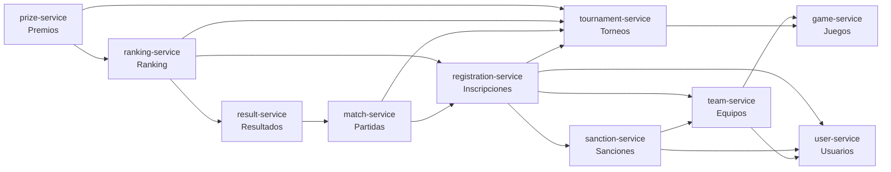

# Proyecto eSports Arena Manager

Proyecto desarrollado para la asignatura FullStack 1, basado en una arquitectura de microservicios con Spring Boot.

El sistema permite administrar una plataforma de torneos eSports, considerando la gestión de usuarios, juegos, equipos, torneos, inscripciones, sanciones, partidas, resultados, ranking y premios.

---

## Integrantes

- Emanuel Serey
- Sebastián Ahumada
- Benjamín Gutiérrez

---

## Tecnologías utilizadas

- Java 25
- Spring Boot 4.0.6
- Spring Web
- Spring Data JPA
- H2 Database
- OpenFeign
- Lombok
- Maven
- IntelliJ IDEA
- Git y GitHub
- Postman
- Trello

---

## Microservicios

| Microservicio | Puerto | Responsabilidad |
|---|---:|---|
| user-service | 8087 | Gestiona usuarios del sistema |
| game-service | 8083 | Gestiona juegos disponibles |
| tournament-service | 8084 | Gestiona torneos |
| team-service | 8085 | Gestiona equipos y miembros |
| registration-service | 8086 | Gestiona inscripciones a torneos |
| sanction-service | 8088 | Gestiona sanciones de usuarios y equipos |
| match-service | 8089 | Gestiona partidas del torneo |
| result-service | 8090 | Gestiona resultados de partidas |
| ranking-service | 8091 | Gestiona ranking y posiciones |
| prize-service | 8092 | Gestiona premios del torneo |

---

## Estructura del proyecto

```text
proyecto-esports-arena/
├── user-service/
├── game-service/
├── tournament-service/
├── team-service/
├── registration-service/
├── sanction-service/
├── match-service/
├── result-service/
├── ranking-service/
├── prize-service/
├── README.md
└── .gitignore
```

Cada microservicio posee su propia estructura Spring Boot:

```text
microservicio/
├── src/
│   ├── main/
│   │   ├── java/
│   │   └── resources/
├── pom.xml
├── mvnw
└── mvnw.cmd
```

---

## Arquitectura general

El sistema se organiza bajo una arquitectura de microservicios. Cada servicio tiene una responsabilidad específica y se comunica con otros servicios mediante clientes Feign.

Cada microservicio cuenta con su propia base de datos H2, evitando una base de datos única centralizada. Las relaciones entre microservicios se manejan mediante identificadores lógicos y validaciones por API REST.

---

## Diagrama del ecosistema de microservicios



---

## Modelo relacional de bases de datos principales

Cada microservicio posee su propia base de datos H2. Por este motivo, las relaciones entre servicios no se implementan como claves foráneas directas entre bases de datos, sino mediante IDs lógicos y validaciones realizadas a través de OpenFeign.

```mermaid
erDiagram
    USUARIOS {
        Long id
        String nombre
        String nickname
        String email
        String rol
        String estado
        LocalDate fecha_registro
    }

    JUEGOS {
        Long id
        String nombre
        String genero
        String modalidad
        Integer jugadores_por_equipo
        Boolean estado
    }

    TORNEOS {
        Long id
        String nombre
        Long juego_id
        LocalDate fecha_inicio
        LocalDate fecha_fin
        Integer cupo_maximo
        String estado
        String modalidad
    }

    EQUIPOS {
        Long id
        String nombre
        Long capitan_id
        Long juego_principal_id
        String estado
    }

    MIEMBROS_EQUIPO {
        Long id
        Long usuario_id
        String rol_dentro_equipo
        Long equipo_id
    }

    INSCRIPCIONES {
        Long id
        Long torneo_id
        Long equipo_id
        Long jugador_id
        String tipo_participante
        String estado
        LocalDate fecha_inscripcion
    }

    SANCIONES {
        Long id
        Long usuario_id
        Long equipo_id
        String motivo
        LocalDate fecha_inicio
        LocalDate fecha_fin
        String estado
        String severidad
    }

    PARTIDAS {
        Long id
        Long torneo_id
        Long participante_aid
        Long participante_bid
        String ronda
        LocalDateTime fecha_hora
        String estado
    }

    RESULTADOS {
        Long id
        Long partida_id
        Long ganador_id
        Integer puntaje_a
        Integer puntaje_b
        String estado_validacion
        LocalDate fecha_registro
    }

    RANKINGS {
        Long id
        Long torneo_id
        Long participante_id
        Integer puntos
        Integer victorias
        Integer derrotas
        Integer diferencia
        Integer posicion
    }

    PREMIOS {
        Long id
        Long torneo_id
        Long participante_id
        Integer posicion
        String tipo_premio
        String descripcion
        String estado_entrega
        LocalDate fecha_asignacion
    }


    EQUIPOS ||--o{ MIEMBROS_EQUIPO : contiene
```



---

## Comunicación entre microservicios

| Microservicio | Consume |
|---|---|
| tournament-service | game-service |
| team-service | user-service, game-service |
| sanction-service | user-service, team-service |
| registration-service | tournament-service, team-service, user-service, sanction-service |
| match-service | tournament-service, registration-service |
| result-service | match-service |
| ranking-service | tournament-service, registration-service, result-service |
| prize-service | tournament-service, ranking-service |

---

## Instrucciones de ejecución

### 1. Clonar el repositorio

```bash
git clone https://github.com/Emanuel-Serey/proyecto-esports-arena-manager.git
cd proyecto-esports-arena-manager
git checkout development
```

### 2. Abrir el proyecto

Abrir la carpeta principal en IntelliJ IDEA:

```text
proyecto-esports-arena/
```

Cada microservicio debe ser reconocido como proyecto Maven mediante su archivo `pom.xml`.

### 3. Ejecutar los microservicios

Cada microservicio se puede ejecutar desde IntelliJ mediante su clase principal:

```text
UserServiceApplication
GameServiceApplication
TournamentServiceApplication
TeamServiceApplication
RegistrationServiceApplication
SanctionServiceApplication
MatchServiceApplication
ResultServiceApplication
RankingServiceApplication
PrizeServiceApplication
```

También se puede ejecutar desde terminal entrando a cada microservicio:

```bash
cd user-service
mvn spring-boot:run
```

### 4. Orden recomendado de ejecución

```text
1. user-service
2. game-service
3. tournament-service
4. team-service
5. sanction-service
6. registration-service
7. match-service
8. result-service
9. ranking-service
10. prize-service
```

---

## Base de datos H2

Cada microservicio utiliza H2 en modo archivo.

Ejemplo de configuración:

```properties
spring.datasource.url=jdbc:h2:file:./data/userdb
spring.datasource.driver-class-name=org.h2.Driver
spring.datasource.username=sa
spring.datasource.password=
spring.jpa.hibernate.ddl-auto=update
spring.h2.console.enabled=true
spring.h2.console.path=/h2-console
```

Consola H2 por microservicio:

| Microservicio | URL H2 |
|---|---|
| user-service | http://localhost:8087/h2-console |
| game-service | http://localhost:8083/h2-console |
| tournament-service | http://localhost:8084/h2-console |
| team-service | http://localhost:8085/h2-console |
| registration-service | http://localhost:8086/h2-console |
| sanction-service | http://localhost:8088/h2-console |
| match-service | http://localhost:8089/h2-console |
| result-service | http://localhost:8090/h2-console |
| ranking-service | http://localhost:8091/h2-console |
| prize-service | http://localhost:8092/h2-console |

---

## Endpoints principales

### user-service

| Método | Endpoint | Descripción |
|---|---|---|
| POST | `/api/usuarios` | Crear usuario |
| GET | `/api/usuarios` | Listar usuarios |
| GET | `/api/usuarios/{id}` | Buscar usuario por ID |
| PUT | `/api/usuarios/{id}` | Actualizar usuario |
| DELETE | `/api/usuarios/{id}` | Desactivar usuario |
| GET | `/api/usuarios/rol/{rol}` | Listar por rol |
| GET | `/api/usuarios/estado/{estado}` | Listar por estado |
| GET | `/api/usuarios/nickname/{nickname}` | Buscar por nickname |

### game-service

| Método | Endpoint | Descripción |
|---|---|---|
| POST | `/api/juegos` | Crear juego |
| GET | `/api/juegos` | Listar juegos |
| GET | `/api/juegos/{id}` | Buscar juego por ID |
| GET | `/api/juegos/activos` | Listar juegos activos |
| PUT | `/api/juegos/{id}` | Actualizar juego |
| DELETE | `/api/juegos/{id}` | Desactivar juego |

### tournament-service

| Método | Endpoint | Descripción |
|---|---|---|
| POST | `/api/torneos` | Crear torneo |
| GET | `/api/torneos` | Listar torneos |
| GET | `/api/torneos/{id}` | Buscar torneo por ID |
| PUT | `/api/torneos/{id}` | Actualizar torneo |
| PUT | `/api/torneos/{id}/cancelar` | Cancelar torneo |
| PUT | `/api/torneos/{id}/cerrar` | Cerrar torneo |
| GET | `/api/torneos/juego/{juegoId}` | Listar por juego |
| GET | `/api/torneos/estado/{estado}` | Listar por estado |

### team-service

| Método | Endpoint | Descripción |
|---|---|---|
| POST | `/api/equipos` | Crear equipo |
| GET | `/api/equipos` | Listar equipos |
| GET | `/api/equipos/{id}` | Buscar equipo por ID |
| PUT | `/api/equipos/{id}` | Actualizar equipo |
| DELETE | `/api/equipos/{id}` | Desactivar equipo |
| POST | `/api/equipos/{equipoId}/miembros` | Agregar miembro |
| GET | `/api/equipos/{equipoId}/miembros` | Listar miembros |
| DELETE | `/api/equipos/{equipoId}/miembros/{miembroId}` | Eliminar miembro |

### registration-service

| Método | Endpoint | Descripción |
|---|---|---|
| POST | `/api/inscripciones` | Crear inscripción |
| GET | `/api/inscripciones` | Listar inscripciones |
| GET | `/api/inscripciones/{id}` | Buscar inscripción por ID |
| PUT | `/api/inscripciones/{id}/estado/{estado}` | Actualizar estado |
| PUT | `/api/inscripciones/{id}/cancelar` | Cancelar inscripción |
| GET | `/api/inscripciones/torneo/{torneoId}` | Listar por torneo |
| GET | `/api/inscripciones/equipo/{equipoId}` | Listar por equipo |
| GET | `/api/inscripciones/jugador/{jugadorId}` | Listar por jugador |

### sanction-service

| Método | Endpoint | Descripción |
|---|---|---|
| POST | `/api/sanciones` | Crear sanción |
| GET | `/api/sanciones` | Listar sanciones |
| GET | `/api/sanciones/{id}` | Buscar sanción por ID |
| PUT | `/api/sanciones/{id}` | Actualizar sanción |
| PUT | `/api/sanciones/{id}/cerrar` | Cerrar sanción |
| GET | `/api/sanciones/usuario/{usuarioId}` | Listar por usuario |
| GET | `/api/sanciones/equipo/{equipoId}` | Listar por equipo |
| GET | `/api/sanciones/usuario/{usuarioId}/activa` | Validar sanción activa de usuario |
| GET | `/api/sanciones/equipo/{equipoId}/activa` | Validar sanción activa de equipo |

### match-service

| Método | Endpoint | Descripción |
|---|---|---|
| POST | `/api/partidas` | Crear partida |
| GET | `/api/partidas` | Listar partidas |
| GET | `/api/partidas/{id}` | Buscar partida por ID |
| PUT | `/api/partidas/{id}` | Actualizar partida |
| PUT | `/api/partidas/{id}/estado/{estado}` | Actualizar estado |
| PUT | `/api/partidas/{id}/cancelar` | Cancelar partida |
| GET | `/api/partidas/torneo/{torneoId}` | Listar por torneo |

### result-service

| Método | Endpoint | Descripción |
|---|---|---|
| POST | `/api/resultados` | Crear resultado |
| GET | `/api/resultados` | Listar resultados |
| GET | `/api/resultados/{id}` | Buscar resultado por ID |
| PUT | `/api/resultados/{id}` | Actualizar resultado |
| PUT | `/api/resultados/{id}/validar` | Validar resultado |
| PUT | `/api/resultados/{id}/anular` | Anular resultado |
| GET | `/api/resultados/partida/{partidaId}` | Buscar por partida |

### ranking-service

| Método | Endpoint | Descripción |
|---|---|---|
| POST | `/api/rankings` | Crear ranking |
| GET | `/api/rankings` | Listar rankings |
| GET | `/api/rankings/{id}` | Buscar ranking por ID |
| GET | `/api/rankings/torneo/{torneoId}` | Listar ranking por torneo |
| GET | `/api/rankings/torneo/{torneoId}/participante/{participanteId}` | Buscar posición de participante |
| PUT | `/api/rankings/{id}` | Actualizar ranking |
| DELETE | `/api/rankings/torneo/{torneoId}/reiniciar` | Reiniciar ranking |
| PUT | `/api/rankings/resultado/{resultadoId}` | Actualizar ranking por resultado |

### prize-service

| Método | Endpoint | Descripción |
|---|---|---|
| POST | `/api/premios` | Asignar premio |
| GET | `/api/premios` | Listar premios |
| GET | `/api/premios/{id}` | Buscar premio por ID |
| GET | `/api/premios/torneo/{torneoId}` | Listar premios por torneo |
| GET | `/api/premios/participante/{participanteId}` | Listar premios por participante |
| PUT | `/api/premios/{id}/entregar` | Entregar premio |
| PUT | `/api/premios/{id}/anular` | Anular premio |

---

## Colección Postman

Se incluye una colección Postman con pruebas REST para los flujos principales del sistema.

Flujos principales considerados:

```text
1. Crear usuario
2. Crear juego
3. Crear torneo
4. Crear equipo
5. Crear sanción
6. Intentar inscripción con sanción activa
7. Crear inscripción válida
8. Crear partida
9. Registrar resultado
10. Actualizar ranking
11. Asignar premio
```

La colección se encuentra en:

```text
docs/postman/
```

---

## Evidencia de trabajo colaborativo

El trabajo colaborativo se organizó mediante GitHub y ramas por microservicio.

Ramas utilizadas:

```text
main
development
user-service
game-service
tournament-service
team-service
sanction-service
registration-service
match-service
result-ranking-prize
```

También se incluye evidencia de planificación en Trello u otra herramienta colaborativa.

```text
docs/evidencias/
```